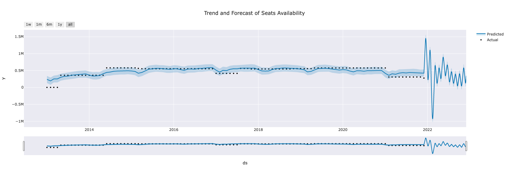

# Machine-Learning-Forecasting

This Repository contains code that does forecasting using facebook's prophet python package.

Forecasting file does forecasting in general.
Forecasting by Category file does forecasting for each category

Below are some of the interactive visual results from algorithm results. 

Github is unable to display interactive plotly charts so static images are embedded here. All these charts are fully interactive in original notebook.

